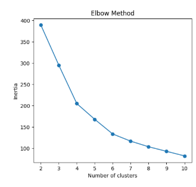
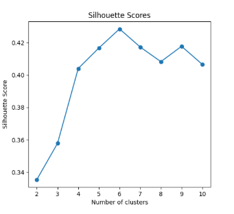
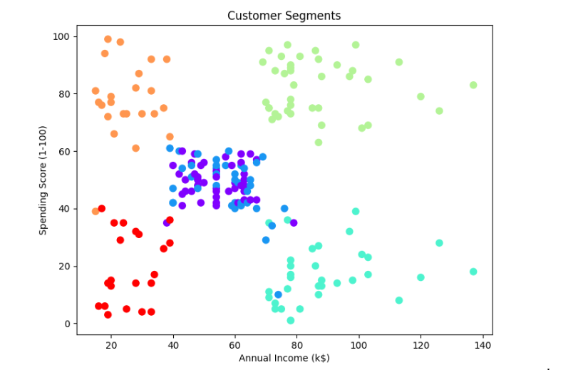

# Customer Segmentation using K-Means

## Overview
This project applies **K-Means clustering** to segment customers based on their behavior and demographics.

The goal is to group similar customers together to better understand purchasing patterns.

---

## Dataset
- Source: Mall Customers Dataset (Kaggle)
- Features used:
  - Age
  - Annual Income (k$)
  - Spending Score (1-100)

---

## Steps

1. Load dataset using pandas  
2. Select numeric features  
3. Handle missing values (filled with mean)  
4. Scale features using StandardScaler  
5. Apply K-Means for k = 2 to 10  
6. Evaluate using:
   - Elbow Method (Inertia)
   - Silhouette Score  
7. Choose the best k based on silhouette score  

---

## Results

- The optimal number of clusters (**k**) is selected based on the **highest silhouette score**.
- Customers are grouped into segments based on income and spending behavior.

---

## Visualizations

### Elbow Method

### Silhouette Scores

### Customer Segments

---
